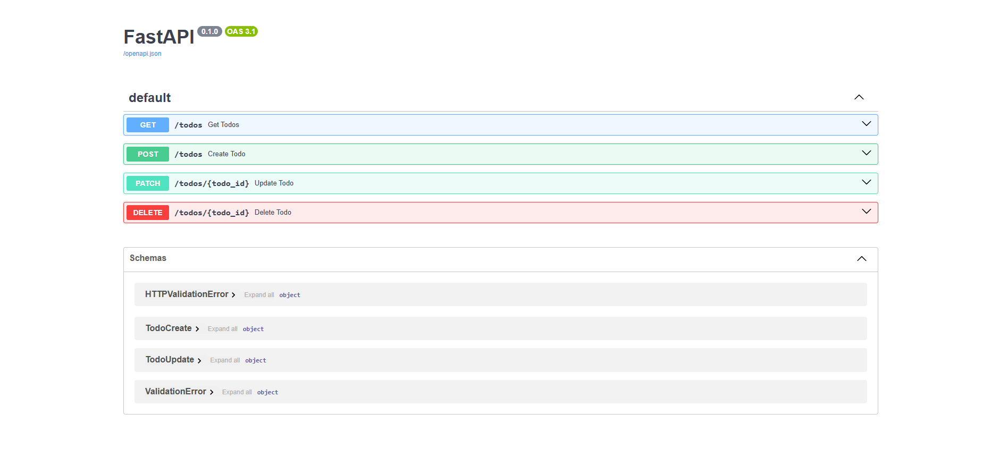

# API Documentation — Swagger UI
## Todo Application

**Version:** 1.0
**Date:** 2026-05-22
**Author:** Timur Rudiuk

---

## Overview

This project uses **FastAPI** as the backend framework. FastAPI automatically generates interactive API documentation using the **OpenAPI 3.1** standard — no additional configuration is required.

---

## How to access Swagger UI

1. Start the backend server:
   ```bash
   uvicorn main:app --reload
   ```
2. Open your browser and go to:
   ```
   http://localhost:8000/docs
   ```

The Swagger UI will be available automatically as long as the backend is running.

---

## Screenshot



---

## Documented Endpoints

### 1. `GET /todos` — Get all todos

Returns a list of all tasks stored in the database.

**Request:** no body required

**Response `200 OK`:**
```json
[
  {
    "id": 1,
    "title": "Buy groceries",
    "completed": false,
    "priority": "high",
    "category": "personal",
    "deadline": "2026-05-30"
  }
]
```

---

### 2. `POST /todos` — Create a new todo

Creates a new task and saves it to the database.

**Request body:**
```json
{
  "title": "Read a book",
  "priority": "low",
  "category": "personal",
  "deadline": "2026-06-01"
}
```

| Field | Type | Required | Description |
|---|---|---|---|
| `title` | string | Yes | Title of the task |
| `priority` | string | Yes | `low`, `medium`, or `high` |
| `category` | string | Yes | Category of the task |
| `deadline` | date | No | Due date in `YYYY-MM-DD` format |

**Response `200 OK`:**
```json
{
  "id": 3,
  "title": "Read a book",
  "completed": false,
  "priority": "low",
  "category": "personal",
  "deadline": "2026-06-01"
}
```

**Response `422 Unprocessable Entity`** — validation error if required fields are missing.